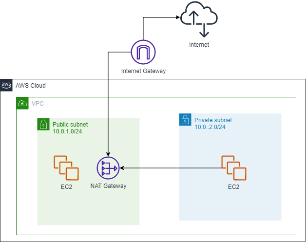

# Introdução ao Terraform
 
Nesse repositório serão encontrados códigos Terraform com o objetivo de provisionar uma fundação simplificada de rede na AWS e uma EC2 rodando um NGINX.

# Arquitetura Proposta

# Conceitos Arquitetura AWS

- https://aws.amazon.com/pt/premiumsupport/knowledge-center/nat-gateway-vpc-private-subnet/
- https://docs.aws.amazon.com/pt_br/vpc/latest/userguide/vpc-nat-gateway.html
- https://docs.aws.amazon.com/pt_br/vpc/latest/userguide/vpc-nat-gateway.html#nat-gateway-creating
- https://docs.aws.amazon.com/pt_br/vpc/latest/userguide/VPC_Scenario2.html

# Módulos AWS Utilizados

 - [VPC](https://registry.terraform.io/providers/hashicorp/aws/latest/docs/resources/vpc)

 - [Subnet](https://registry.terraform.io/providers/hashicorp/aws/latest/docs/resources/subnet)

- [Route](https://registry.terraform.io/providers/hashicorp/aws/latest/docs/resources/route)

- [Route Table](https://registry.terraform.io/providers/hashicorp/aws/latest/docs/resources/route_table)

- [Route Table Association](https://registry.terraform.io/providers/hashicorp/aws/latest/docs/resources/route_table_association)

- [Internet Gateway](https://registry.terraform.io/providers/hashicorp/aws/latest/docs/resources/internet_gateway)

- [Elastic IP](https://registry.terraform.io/providers/hashicorp/aws/latest/docs/resources/eip)

- [Nat Gateway](https://registry.terraform.io/providers/hashicorp/aws/latest/docs/resources/nat_gateway)

- [KeyPair](https://registry.terraform.io/providers/hashicorp/aws/latest/docs/resources/key_pair)

- [Security Group](https://registry.terraform.io/providers/hashicorp/aws/latest/docs/resources/security_group)

- [EC2](https://registry.terraform.io/providers/hashicorp/aws/latest/docs/resources/instance)